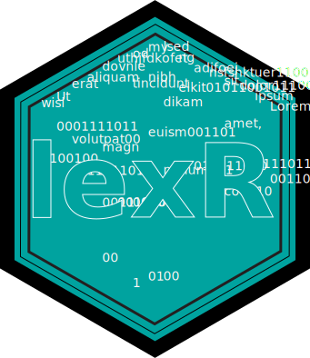

<!-- badges: start -->
[](https://github.com/NicolasJBM/lexR/actions)
[](https://www.codefactor.io/repository/github/nicolasjbm/lexr)
[](https://opensource.org/licenses/GPL-3.0)
[](https://www.tidyverse.org/lifecycle/#experimental)
<!-- badges: end -->


```{r, echo = FALSE}
knitr::opts_chunk$set(
  collapse = TRUE,
  comment = "#>",
  fig.path = "man/figures/README-"
)
```

# lexR 

Toolbox to manipulate and analyze texts.


## Overview

The *lexR* package gathers several functions to prepare texts for subsequent analyses (cleaning, semantic analysis, bags of words) and to facilitate topic modeling.  


## Installation

Before you can install *lexR* itself, you will need to install from CRAN the following packages:  

```{r, eval = FALSE}
install.packages(c("dplyr", "tidyr", "stringr", "purrr", "stm", "tibble", "tidytext", "stats", "textclean", "stringi", "tm", "utils", "clipr", "koRpus.lang.en", "koRpus", "tidygraph", "rhandsontable", "udpipe", "shiny", "miniUI", "knitr"), dependencies = TRUE)
```

Then, install *lexR* from its GitHub public repository:  

```{r, eval = FALSE}
devtools::install.github("NicolasJBM/lexR")
```


## Usage

A first set of functions support the preparation of text for subsequent analyses. See the vignette "Preparing Textual Data for Analysis" for more detail about these functions and the related work flow.  

A second set of functions leverages several functions from other packages for text analysis itself. For more details about this set, see the vignette "Analyzing Textual Data".  

Finally, the packages also includes a function to count words in a string or in the clipboard, *count_words()*, and a small gadget to test what a regex pattern captures, *test_regex()*.


## Toolboxes

*LexR* is necessary to run *[bibliogR](https://github.com/NicolasJBM/bibliogR)* which uses the cleaning functions. The package *[buildR](https://github.com/NicolasJBM/buildR)* inclides some function helping with the analysis of synctatic network produced by the *create_syntrel()* and *create_syntnet()* functions.  

